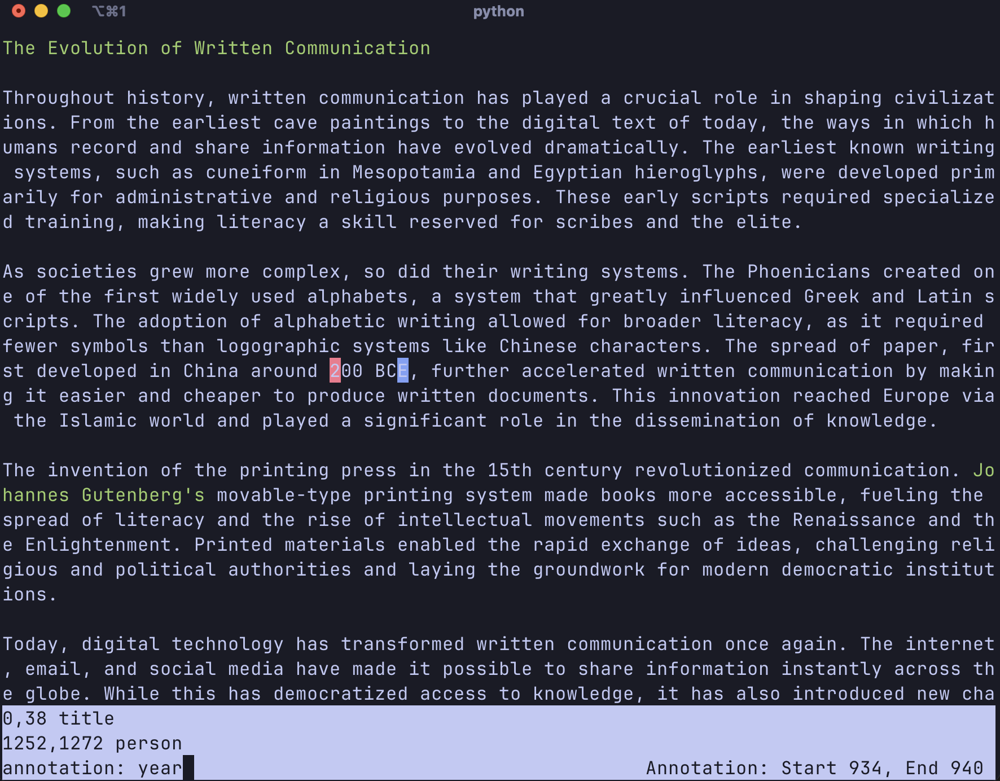

# Text Annotator

CLI tool for text annotation. Start from scratch or load from JSON. Select text spans, add annotations, delete as needed, and save to JSON. Basic highlighting supported.

Supports:
1. overlapping spans
2. multiple labels per span

TODO:
- [ ] links
- [ ] some better colors





```JSON
{
    "start": [
        0,
        1252,
        934
    ],
    "end": [
        38,
        1272,
        941
    ],
    "label": [
        "title",
        "person",
        "year"
    ]
}
```

## Workflow
1. `python annotator.py yourfile.txt`
2. if there is a corresponding yourfile.json, it will be loaded and annotations applied
3. Set start ('s') and end ('e') for annotation span using arrow keys or mouse
   1. shift arrow to jump words or scroll page
4. shift-'A' to add text annotation
5. shift-'R' to remove annotation by index
6. shift-'S' to save to JSON